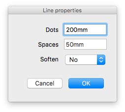
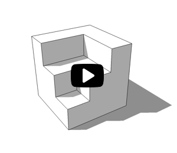

## Dotted Line for SketchUp

This is a SketchUp Ruby extension. Using it you can:

* Replace selected edges by dotted line.
* Customize the length of dot lines and spaces between them.
* Make converted lines soft.

## How to use

1. [Download](https://github.com/syroezhkin/VsDottedLine/releases) and install the lastest version
2. Select edges (only) in SketchUp
3. Right-click on the selection and click **Replace by dotted lines...**
4. Edit the properties and click "Ok"

Choose `Soften` **Yes** if you want to hide the selected edges, or **No** to delete them. Dotted lines will be created in a new group.

If the number of selected edges is more than 100, you will see a window informing you that it may take some time depending on your system hardware to convert the edges.

Watch the video:

## Installing

Place the `vs_dotted_line.rb` file and `vs_dotted_line` folder into plugins folder, and then restart SketchUp.

Windows - the default location is:
`C:\Users\YOUR USERNAME\AppData\Roaming\SketchUp\SketchUp 2015\SketchUp\Plugins`

Mac OS X - the default location is:
Open a new Finder window, press and hold the Option key on your keyboard, then click **Go** in the menu bar **> Library > Application Support > SketchUp # > SketchUp > Plugins**
